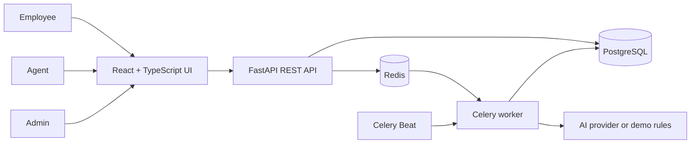

# DeskFlow — IT Service Desk with AI Triage

A portfolio service desk for a final-year student. Employees submit IT tickets; AI suggests a category and priority; application rules assign a support team; agents work the request; SLA deadlines and escalation keep overdue work visible.

This is a **working application**, with employee, agent and admin experiences. The system keeps AI suggestions separate from final decisions so agents can inspect and override them.

## Demo at a glance

| Login | Password | What to try |
|---|---|---|
| `employee@demo.dev` | `Demo123!` | Create a payroll access ticket and follow its progress |
| `agent@demo.dev` | `Demo123!` | Review AI triage, change priority, reply and resolve |
| `admin@demo.dev` | `Demo123!` | Edit SLA targets and run an escalation check |

The seed data includes an overdue VPN ticket for the escalation demonstration.

## Real user accounts

- On the sign-in screen, select **Create an account** to register as an employee. Use your own email and a password of at least 10 characters with a letter and a number. The account is saved in the database and signed in immediately.
- An admin can open **Administration → Create agent account**, set an initial password, and assign the new agent to a support team. Public registration cannot create an agent or admin role.
- Every signed-in user can open **My account** to change their password. This invalidates their earlier session cookies.
- Passwords are stored as salted PBKDF2 hashes. Authentication uses an HTTP-only, same-site session cookie with an eight-hour expiry. API routes enforce employee, agent and admin permissions on the server.

The seeded accounts above remain available for a local portfolio walkthrough. For any public deployment, remove or disable those known demo credentials, set a unique `SECRET_KEY`, and serve the app over HTTPS with `COOKIE_SECURE=true`. Email verification, password recovery, and organization SSO are outside this portfolio build.

## Architecture



- **Frontend:** React 19, TypeScript, Vite, CSS, Lucide icons.
- **Backend:** FastAPI, Pydantic, SQLAlchemy, JWT session cookie.
- **Data:** PostgreSQL in Docker; SQLite works for a simple local walkthrough and the test suite.
- **Jobs:** Redis, Celery worker and Celery Beat in Docker. Local mode runs AI triage via FastAPI background tasks; an admin can trigger the SLA check from the UI.
- **AI:** OpenAI Responses API with a strict JSON schema when configured. The default `demo` provider uses clearly labelled keyword rules, so the workflow runs without a paid API key.

## Full ticket workflow

1. Employee submits a title, description, affected service, impact and urgency. The API commits the ticket before AI starts.
2. A background job returns category, priority, summary, explanation and confidence.
3. The backend validates the output. Low-confidence, `OTHER` and P1 suggestions require review. Team assignment comes from category-to-team rules.
4. The SLA engine calculates response and resolution deadlines using a 09:00–17:00 Monday–Friday calendar for P2–P4. P1 uses a 24/7 calendar. The timezone is configurable.
5. Agents may change category, priority, team, assignee and status. Only a public agent reply stops the response clock; internal notes do not.
6. The scheduled job checks deadlines every minute. It records each breach once, changes the ticket to `ESCALATED`, and alerts the team. The admin screen can run the check on demand for a demo.
7. Comments, AI suggestions, assignments, status changes and breaches appear in the audit timeline.

`WAITING_FOR_EMPLOYEE` pauses the resolution clock. An employee reply resumes the ticket and extends the deadline by the applicable paused working minutes. Reopening a resolved ticket starts a new resolution deadline.

## Run with Docker Compose

1. Copy `.env.example` to `.env`.
2. Change `SECRET_KEY` if the app will be reachable by anyone else.
3. Run:

   ```bash
   docker compose up --build
   ```

4. Open `http://localhost:3000`. FastAPI's interactive API docs are at `http://localhost:8000/docs`.

The API container creates tables and seed data on first startup. A PostgreSQL volume keeps data between restarts.

### Turn on live AI

In `.env`, set `AI_PROVIDER=openai` and `OPENAI_API_KEY` to your own key. Keep the key in `.env`; never commit it. `OPENAI_MODEL` can be changed to an available model that supports structured output. With no key, leave `AI_PROVIDER=demo`. The UI labels demo-rule output honestly.

## Run without Docker

This mode uses SQLite and runs triage in-process. It is useful when Docker is unavailable. Python 3.12+ and Node 22+ are recommended.

1. Copy `.env.local.example` to `backend/.env`.
2. In one terminal:

   ```bash
   cd backend
   python -m venv .venv
   .\.venv\Scripts\python.exe -m pip install -r requirements-dev.txt  # PowerShell
   .\.venv\Scripts\python.exe -m app.seed
   .\.venv\Scripts\python.exe -m uvicorn app.main:app --reload
   ```

   On macOS/Linux, replace `.\.venv\Scripts\python.exe` with `.venv/bin/python`.

3. In another terminal:

   ```bash
   cd frontend
   npm ci
   npm run dev
   ```

4. Open `http://localhost:5173`.

Local mode has no always-running SLA scheduler. Use **Administration → Check deadlines** to show escalation, or run `python -c "from app.jobs import check_sla_now; check_sla_now()"` from `backend`.

## Tests and checks

From the project root, run `cd backend && python -m pytest -q`, then `cd ../frontend && npm run build`.

The backend tests cover role access, internal-note visibility, AI routing, state transitions, first-response rules, business-hour deadlines and idempotent SLA escalation. GitHub Actions runs the same checks on pushes and pull requests.

## Portfolio walkthrough

1. Sign in as the employee and create: **“Payroll access blocked after password reset.”**
2. Open the new ticket and watch the category, priority, assigned team and SLA deadlines appear.
3. Sign in as the agent to inspect the AI reason, change the priority or assignment, add a public reply and resolve the ticket.
4. Sign in as the admin and run the SLA check. Open the seeded VPN ticket to show its breach and audit event.
5. Explain how a failed AI call routes to manual review while ticket submission still succeeds.

## Project boundaries

This portfolio build intentionally uses seeded demo accounts and a single service desk. It does not include company SSO, multi-tenancy, CMDB integrations, email ingestion or a full service catalog. File attachments and public deployment are also outside this version. Before making the demo publicly reachable, replace the default secret and credentials and configure HTTPS with `COOKIE_SECURE=true`.

The source architecture follows the accompanying PDF blueprint. The deployed Docker path uses PostgreSQL and Celery; the SQLite local path is a convenience for reviewers.

